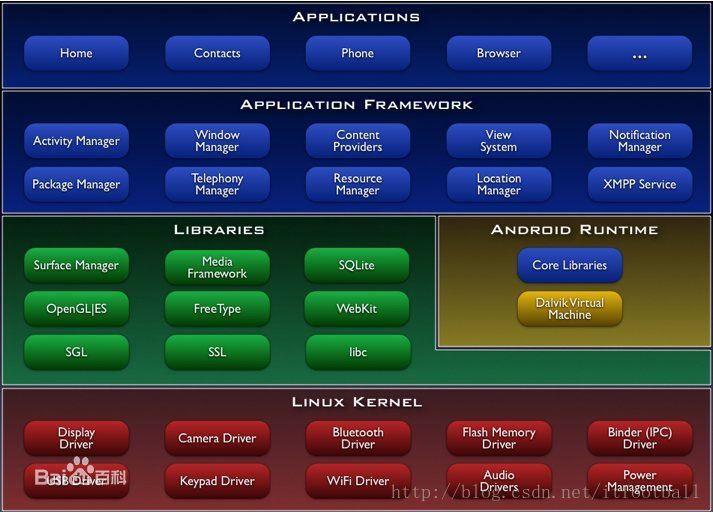

# Android源码学习1：Activity

>复习下Android的四大组件哪几个？Activity, Service, ContentProvider, BroadcastReceiver。其中我们最常用的是Activity和Service，我们可以把Service理解为不带界面的Activity，并且可在后台运行。

>本文主要结合Activity源码，理解Activity在使用过程中，我们经常会遇到需要这么做，但是不知道为什么这样做的问题，理解Activity使用中一些hack技巧的原理。从而为我们的进阶之路积攒能量.

# 前言
首先，复习下Android的组织结构：

我们大部分Android开发都是app开发，主要是ui的堆叠，我们戏称为Android垒ui的，因为app开发主要是图中的application层，被FrameWork层屏蔽掉了大部分底层开发工作，平时ui+一堆第三方库就能垒出来大部分app，做的多了会赶脚特别没有技术含量，也没有竞争力、安全感，这时候会迫切的希望学习FramWork乃至AndroidRuntime层的知识，那就开始吧！

Framework层，可以理解为用Java语言实现了底层硬件操作的api集合，供上层app调用。FrameWork呢主要干两件事：

1. 用Java语言编写一些规范化的模块封装成框架，供APP层开发者调用开发出app。
2. 用Java Native Interface调用core lib层的本地方法，也就是可以在app里用java代码调用c/c++写得接口或者实现。JNI的库是在Dalvik虚拟机启动时加载进去的，Dalvik会直接去寻址这个JNI方法，然后去调用

通过以上两种方式，就到达了java与Android操作系统的通信，我们在平时app开发，主要是使用FrameWork提供的接口，所以了解FrameWork层接口的实现，对于我们呢的进阶之路还是蛮重要的。

# Activity
字面意思，每一个Activity都要被ActivityManage所管理，管理应用程序生命周期并提供常用的导航回退功能。
>辅助知识：
>
>Window Manager：提供一些我们访问手机屏幕的方法。屏幕的透明度、亮度、背景。
>
>Content Providers：使得应用程序可以访问另一个应用程序的数据（如联系人数据库，自定义的联系人需要使用系统联系人的数据库)， 或者共享它们自己的数据。
>
>View System：可以用来构建应用程序， 它包括列表（Lists)，网格（Grids)，文本框（Text boxes)，按钮（Buttons)， 甚至可嵌入的web浏览器
>
>Notification Manager：使得应用程序可以在状态栏中显示自定义的提示信息。
>Package Manager：提供对系统的安装包的访问。包括安装、卸载应用，查询permission相关信息，查询Application相关信息等。
>Telephony Manager：主要提供了一系列用于访问与手机通讯相关的状态和信息的方法，查询电信网络状态信息，sim卡的信息等。
>Resource Manager：提供非代码资源的访问，如本地字符串，图形，和布局文件（Layout files )。
>Location Manager:提供设备的地址位置的获取方式。很显然，GPS导航肯定能用到位置服务
>XMPP:可扩展通讯和表示协议。前身为Jabber，提供即时通信服务。例如推送功能,Google Talk。

